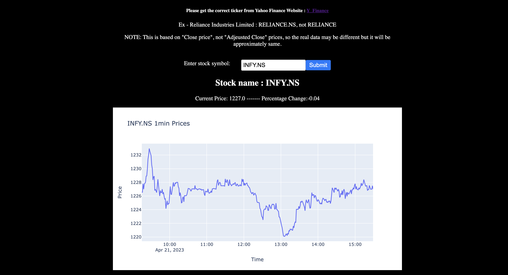

# Real-Time Stock Price Dashboard
## Poojya Lal
---
<br>
This project is a simple web application that allows users to view stock prices for a given stock ticker symbol. The application is built using the Django web framework and the Plotly JavaScript library for creating interactive graphs. The user enters the stock ticker symbol in a form on the web page, and the application fetches the latest stock prices from an external API and displays them in a graph on the same page. The graph is updated every minute to show the latest prices.

Please get the correct ticker from Yahoo Finance Website : [y_finance](https://finance.yahoo.com/)

Ex - Reliance Industries Limited : RELIANCE.NS, not RELIANCE

_NOTE: This is based on "Close price", not "Adjusted Close" prices, so the real data may be different but it will be approximately same._

## Screenshots



<br>

## Running the Code

1. Clone the repository

```
git clone <repository-url>
```

2. Navigate to the project directory

```
cd stockmarket
```

3. Install the project dependencies

```
pip install -r requirements.txt
```

4. Run the development server.

```
python manage.py runserver
```

5. Go to this link in your browser

```
http://localhost:8000/stock-prices/
```
